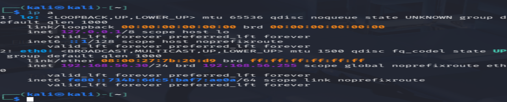
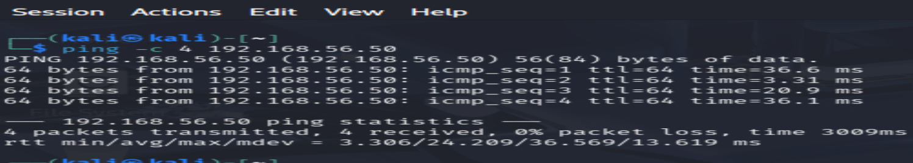
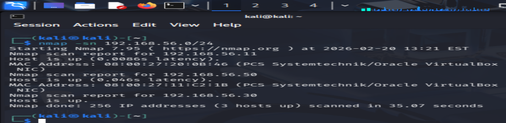
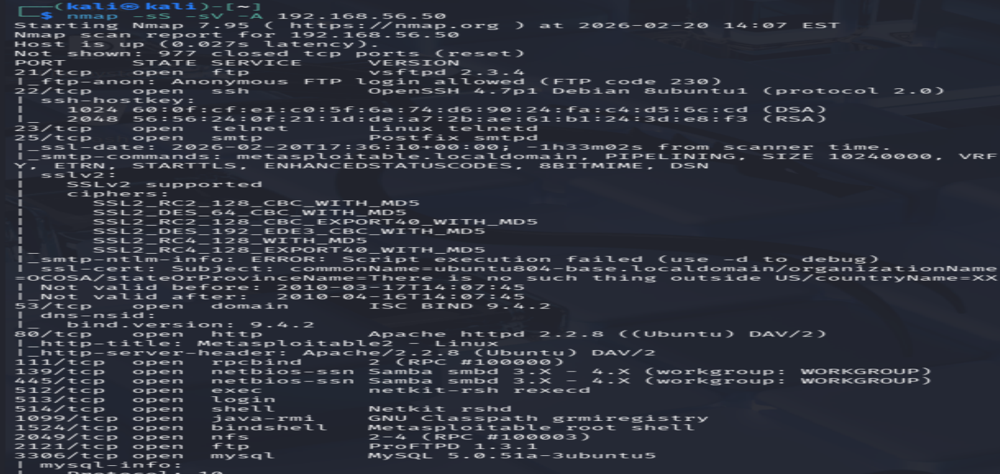

# Lab 1 – Network Reconnaissance & Host Discovery

Environment: Kali + Metasploitable 2 + Windows 11

## Introduction

This lab focuses on the reconnaissance phase of a penetration test within an isolated virtual lab environment.The aim is to identify live hosts and enumerate exposed services without performing exploitation.

The target environment includes:

Kali Linux (Attacker) – 192.168.56.30
Metasploitable 2 (Target) – 192.168.56.50
Windows 11 (Secondary Target for use in further labs) - 192.168.56.11

All vms are connected on a VirtualBox internal network.

## Objectives

- Verify network connectivity
- Identify live hosts on the subnet
- Enumerate open ports and services
- Identify potential attack surface
- Document findings 

### Step 1 – Verify Network Configuration
ip a (on each vm to verify IP addresses)
#### Screenshot

### Step 2 – Verify Metasploitable2 is Reachable
ping 192.168.56.50

Successful ICMP replies confirms: Layer 3 connectivity
#### Screenshot

### Step 3 – Host Discovery
nmap -sn 192.168.56.0/24

The -sn option did a ping scan without port scanning and identified the 3 vms
#### Screenshot

### Step 4 – Port Scanning & Service Enumeration
nmap -sS -sV -A 192.168.56.50

-sS TCP SYN (stealth) scan
-sV Service version detection
-A Aggressive scan

#### Screenshot

Metasploitable exposes numerous outdated services, significantly increasing the attack surface.

### MITRE ATT&CK mapping

- Tactic: Reconnaissance (TA0043)
- Technique: Active Scanning (T1595)
- Sub‑technique: Vulnerability Scanning (T1595.002)

### Findings

- Metasploitable2 exposes 20+ services including FTP, Telnet, SSH, SMB, and MySQL
- Several services run outdated or vulnerable versions
- Indicators of misconfiguration

If this were a production environment, exposure of services like FTP, Telnet, and SMB would be considered high risk.

### Outcomes Achieved

- Performed network reconnaissance
- Identified live systems within a subnet
- Enumerated open ports and service versions
- Interpreted scan results 
- Documented findings for formal reporting

### Why this matters

Reconnaissance is the first phase of the cyber kill chain. Attackers use it to map the environment, identify weak points, and plan exploitation. Understanding this phase helps defenders recognise early indicators of compromise.
